# M3U8 Converter Blog Content Guidelines and Plan

> 📅 Last Updated: 2026-02-13  
> 🌐 Domain: https://www.m3u8converter.com/blog/

---

## 📋 Content Scope

### Core Topics
Blog content should focus on these core areas:

| Topic Category | Description | Priority |
|----------------|-------------|----------|
| **M3U8/HLS Technology** | Protocol principles, format parsing, technical depth | ⭐⭐⭐ |
| **Video Download Tutorials** | User guides, tool usage, problem solving | ⭐⭐⭐ |
| **Format Conversion** | MP4/WebM/MKV conversion methods | ⭐⭐⭐ |
| **Tool Reviews** | Downloader and converter comparisons | ⭐⭐ |
| **FFmpeg Tutorials** | Command-line usage, parameter details | ⭐⭐ |
| **Streaming Industry** | Technology trends, platform updates | ⭐ |

### Prohibited Content
- ❌ Guides for downloading copyrighted content
- ❌ Methods to bypass paid video paywalls
- ❌ Operations violating platform Terms of Service
- ❌ Malware promotion

---

## ✍️ Article Writing Guidelines

### Standard Authoring Workflow (Only Allowed Method)

New articles must be created with the template generator.  
Manual copy/paste from old blog HTML files is deprecated and should not be used.

**Source of truth files:**
- `/blog/templates/article.template.html`
- `/blog/article-base.css`
- `/blog/lang-switcher.js`
- `/blog/lang-switcher.css`
- `/scripts/new-blog-article.mjs`

**Create a new article:**

```bash
npm run blog:new -- \
  --slug=your-article-slug \
  --title-zh="中文标题" \
  --title-en="English Title" \
  --desc-zh="中文描述" \
  --desc-en="English description"
```

Generated output: `/blog/<slug>.html`

Then fill the generated TODO blocks and keep the generated page structure unchanged:
- `.article-topbar` (breadcrumb + language switcher in one row)
- `article > .article-header > .article-meta`
- `.article-content` with bilingual `data-lang="zh"` and `data-lang="en"` blocks
- Footer back link and shared module scripts

### Content Requirements

| Item | Requirement |
|------|-------------|
| **Title** | Include primary keyword, 20-35 characters, English-First |
| **Body Text** | Bilingual complete coverage; avoid thin content; target 1500-3000 words total |
| **Paragraphs** | Max 4 lines per paragraph for readability |
| **Subheadings** | Use H2/H3 hierarchy with long-tail keywords |
| **Images** | At least 2 images, WebP format, stored in `/blog/images/` |
| **Internal Links** | At least 2 links to other blog articles + at least 1 link to tool page |
| **External Links** | 1-2 authoritative source links |
| **CTA** | Must include tool usage guidance |
| **Primary Intent Match** | First screen must answer the main query directly within 120 words |
| **Cannibalization Check** | Each post must define one primary keyword; if overlap with existing page > 60%, update old page instead of creating a new one |
| **Query-driven FAQ** | Include at least 3 FAQ items sourced from real Search Console queries |
| **Unique Value Block** | Must include at least one original comparison table/checklist/error matrix, not generic rewrite |

### Content Quality Scorecard (Must Pass Before Publish)

Score each draft before publish. Minimum pass score: **80/100**.

| Dimension | Weight | Pass Rule |
|-----------|--------|-----------|
| **Intent Match** | 25 | Main query answered in first screen + clear solution path |
| **Uniqueness** | 20 | Has unique section (matrix/checklist/decision tree) not duplicated in existing posts |
| **Depth & Accuracy** | 20 | Practical steps, edge cases, and limitations are covered without factual conflicts |
| **On-page SEO** | 15 | Title/H1/meta/canonical/schema all complete and aligned |
| **Internal Linking** | 10 | At least 3 contextual internal links (2 related posts + 1 tool page) |
| **Readability & UX** | 10 | Clear H2/H3 hierarchy, short paragraphs, bilingual consistency |

### Image Resources

| Item | Requirement |
|------|-------------|
| **Storage Directory** | `/blog/images/[article-slug]/` |
| **Naming Convention** | Lowercase, hyphenated, e.g., `step-1-open-browser.webp` |
| **Format** | WebP preferred, PNG/JPG for compatibility |
| **Dimensions** | Max width 1200px, file size < 200KB |
| **Alt Text** | Required, include relevant keywords |

### Bilingual Support
- All blog detail articles must provide both Chinese and English versions (mandatory)
- Single-language blog pages are forbidden
- Chinese-only blog pages are strictly prohibited
- 严禁发布单语中文 Blog（必须中英双语）
- Use `data-lang="zh"` / `data-lang="en"` tags for switching
- All blog detail pages must use the shared language switcher template
- Language switcher must be compact (pill style), not a full-width top bar
- Place switcher and breadcrumb in the same top row (`.article-topbar`) inside `.article-container`
- Desktop: breadcrumb on the left, switcher on the right; mobile: stack vertically and left-align
- Bilingual pairing rule: key blocks (`breadcrumb`, `h1`, meta text, main paragraphs, CTA, back link) must have both `data-lang="zh"` and `data-lang="en"` variants
- Do not leave plain text-only sections in detail pages after adding language switcher
- If bilingual content is incomplete, the article must not be published
- Required shared files:
  - `/blog/lang-switcher.css`
  - `/blog/lang-switcher.js`
- Required shared base style:
  - `/blog/article-base.css`
- Required markup snippet:

```html
<div class="article-topbar">
  <nav class="breadcrumb">
    <span data-lang="zh"><a href="/">首页</a> / <a href="/blog/">博客</a> / 文章标题</span>
    <span data-lang="en"><a href="/">Home</a> / <a href="/blog/">Blog</a> / Article Title</span>
  </nav>
  <div class="lang-switcher-wrap">
    <div class="lang-switcher" data-lang-switcher>
      <button class="lang-btn" type="button" data-lang-target="zh" aria-pressed="false">中文</button>
      <button class="lang-btn" type="button" data-lang-target="en" aria-pressed="false">EN</button>
    </div>
  </div>
</div>
```

### Language Switcher QA Gate (Required Before Publish)
1. Run structure check (must return no FAIL lines):

```bash
for f in blog/*.html; do
  [ "$(basename "$f")" = "index.html" ] && continue
  en=$(grep -o 'data-lang="en"' "$f" | wc -l | tr -d ' ')
  zh=$(grep -o 'data-lang="zh"' "$f" | wc -l | tr -d ' ')
  if [ "$en" -eq 0 ] || [ "$zh" -eq 0 ]; then
    echo "FAIL: $f is not fully bilingual (en:$en zh:$zh)"
  fi
done
```

2. Manual verification:
- Click `中文` and `EN`; breadcrumb (`首页/博客` ↔ `Home/Blog`), title, meta, and first screen body must visibly change
- Verify topbar is one row on desktop and stacked on mobile; switcher remains compact and not full-width

---

## 🔍 SEO Requirements

### Page SEO Checklist

- [ ] **Title Tag**: Keyword first, brand last, within 60 characters
- [ ] **Meta Description**: Include keywords, 150-160 characters
- [ ] **Canonical URL**: Must be self-referencing and use `https://www.m3u8converter.com/blog/<slug>.html`
- [ ] **H1 Tag**: Unique per page, include primary keyword
- [ ] **URL Slug**: Lowercase, keywords hyphenated
- [ ] **Schema.org**: Add Article structured data
- [ ] **Open Graph**: og:title, og:description, og:image
- [ ] **Image Alt**: Descriptive text with keywords

### Search Console Signals (2026-02 Snapshot)

Current keyword signals indicate three priorities:

1. **Validated intent (already clicked):**
- `how to extract m3u8 link`
- `m3u8 downloader online`

2. **High-impression, low-click opportunities:**
- `ffmpeg download m3u8 tutorial`
- `m3u8 to mp4`
- `m3u8 to mp4 online`

3. **New long-tail opportunities (needs dedicated sections/pages):**
- `mp4 to m3u8`, `video to m3u8`, `convert video to m3u8`
- `get m3u8 from url online`, `get m3u8 link`, `index.m3u8`, `/index.m3u8`
- `video downloadhelper m3u8`, `the stream detector`
- `ffmpeg.wasm hls m3u8 to mp4 in browser`
- `download hls encrypted video`
- `no m3u8 links have been found on this site`
- `online m3u8 downloader`, `online m3u8 to mp4 converter`, `m3u8 video downloader online`, `download m3u8 videos online`, `m3u8 转 mp4 在线`

### Indexation Guardrails (Crawled - currently not indexed)

When pages are crawled but not indexed, treat as a quality + architecture issue first:

1. **Canonical consistency**
- Use only one canonical host: `https://www.m3u8converter.com`
- Do not publish canonicals with `m3u8-converter.com` or non-www variants

2. **Internal linking minimum**
- New page must be linked from `/blog/index.html`
- New page must be linked from `/index.html` blog block
- Add contextual in-content links from at least 2 existing relevant articles to the new page

3. **Sitemap quality**
- Include only canonical URLs in `/public/sitemap.xml`
- Update `<lastmod>` on publish/major refresh

4. **Quality threshold before publish**
- No placeholder or repetitive bilingual filler
- No near-duplicate topic that already exists unless this is a refresh/merge strategy
- Must contain one “why this page is unique” section (e.g., tool comparison matrix, troubleshooting decision tree, or tested command set)

5. **Re-index remediation SOP**
- Day 7 not indexed: strengthen intro + add unique section + add 2 internal links in
- Day 14 not indexed: merge/redirect overlapping page or significantly rewrite (>30% new content)
- Day 28 not indexed: consolidate with stronger canonical page; avoid expanding low-value URL count

### Keyword Strategy

#### Core Keywords (English)
```
m3u8 downloader, m3u8 to mp4, m3u8 converter, 
hls downloader, download m3u8 video, merge ts files,
convert m3u8 to mp4 online, free video downloader
```

#### Core Keywords (Chinese)
```
m3u8下载器, m3u8转mp4, m3u8视频下载, m3u8转换器, 
在线m3u8下载, TS合并MP4, 直播回放下载, 网页视频下载,
HLS下载, 视频流下载
```

#### Long-tail Keyword Examples
- How to download M3U8 video from webpage
- What software opens M3U8 files
- Methods to extract M3U8 link from browser
- Free online M3U8 to MP4 converter tools
- MP4 to M3U8 conversion in browser
- Get M3U8 from URL online safely
- Download HLS encrypted video legally
- No M3U8 links found on this site

### Internal Linking Strategy

Each article must link to:
1. **Tool Homepage** - Guide users to use the tool
2. **Related Tutorials** - Increase dwell time
3. **Technical Deep-dives** - Interconnect comprehensive content

### Topic Cluster Rules (Avoid Cannibalization)

Use one hub + multiple spokes model:

1. **Hub pages**
- `how-to-download-m3u8-video.html`
- `m3u8-to-mp4-guide.html`
- `browser-extract-m3u8.html`

2. **Spoke pages**
- Tool- or scenario-specific posts (e.g., mobile, ffmpeg.wasm, encrypted/hls, error fixes)

3. **Mandatory linking direction**
- Spoke → relevant hub (at least 1 link)
- Hub → high-priority spoke (at least 2 links per hub refresh cycle)
- New spoke pages must receive at least 2 in-content links from existing pages within 7 days

4. **When not to create a new page**
- If query intent is already satisfied by an existing page and only wording differs
- If expected content overlap with an existing page is greater than 60%
- In these cases, refresh and expand the existing URL instead of adding a new one

---

## 📚 Current Article List

| # | Filename | Title (English) | Target Keywords | Status |
|---|----------|-----------------|-----------------|--------|
| 1 | `how-to-download-m3u8-video.html` | How to Download M3U8 Video - Complete Tutorial | m3u8 download tutorial | ✅ Published |
| 2 | `m3u8-to-mp4-guide.html` | Ultimate Guide to M3U8 to MP4 Conversion | m3u8 to mp4 | ✅ Published |
| 3 | `what-is-hls-streaming.html` | What is HLS Streaming? M3U8 Format Explained | HLS streaming, M3U8 format | ✅ Published |
| 4 | `merge-ts-files-to-mp4.html` | 3 Methods to Merge TS Files into MP4 | merge TS to MP4 | ✅ Published |
| 5 | `best-m3u8-downloader-2026.html` | Best M3U8 Downloaders in 2026 | best m3u8 downloader | ✅ Published |
| 6 | `ffmpeg-m3u8-commands.html` | Complete FFmpeg Commands for M3U8 Download | ffmpeg m3u8 | ✅ Published |
| 7 | `browser-extract-m3u8.html` | 5 Methods to Extract M3U8 Link from Browser | extract m3u8 link | ✅ Published |
| 8 | `m3u8-vs-mp4-difference.html` | M3U8 vs MP4: What's the Difference? | m3u8 vs mp4 | ✅ Published |
| 9 | `mobile-m3u8-download.html` | Mobile M3U8 Video Download Tutorial | mobile m3u8 download | ✅ Published |
| 10 | `fix-m3u8-download-errors.html` | Common M3U8 Download Errors and Fixes | m3u8 download failed | ✅ Published |
| 11 | `download-live-stream.html` | How to Download Live Stream Recordings | live stream download | ✅ Published |

---

## 📅 Future Article Plans

### Completed (Reference)

| Status | Filename | Notes |
|--------|----------|-------|
| ✅ | `ffmpeg-m3u8-commands.html` | FFmpeg intent covered |
| ✅ | `browser-extract-m3u8.html` | Extraction intent covered |
| ✅ | `m3u8-vs-mp4-difference.html` | Format comparison covered |
| ✅ | `download-live-stream.html` | Live replay intent covered |
| ✅ | `fix-m3u8-download-errors.html` | Core troubleshooting intent covered |

### Next Posts Roadmap (Data-driven, 2026 Q1-Q2)

| Priority | Filename | Title | Primary Query Cluster | Why Now |
|----------|----------|-------|-----------------------|---------|
| 🔴 High | `online-m3u8-downloader.html` | Online M3U8 Downloader: Convert M3U8 to MP4 in Browser | m3u8 downloader online / online m3u8 downloader / online m3u8 to mp4 converter / m3u8 转 mp4 在线 | Transactional queries already showing impressions |
| 🔴 High | `mp4-to-m3u8-convert.html` | MP4 to M3U8: How to Convert Video to HLS (Step-by-Step) | mp4 to m3u8 / video to m3u8 / convert video to m3u8 | Clear uncovered intent gap |
| 🔴 High | `download-hls-encrypted-video.html` | Download HLS Encrypted Video: Legal Scenarios, Limits, and Methods | download hls encrypted video | High-risk query; needs compliant and authoritative content |
| 🟡 Medium | `get-m3u8-from-url-online.html` | Get M3U8 Link from URL Online: 6 Reliable Methods | get m3u8 from url online / get m3u8 link / index.m3u8 | Early demand with extraction intent refinement |
| 🟡 Medium | `video-downloadhelper-m3u8-guide.html` | Video DownloadHelper & Stream Detector for M3U8: Practical Guide | video downloadhelper m3u8 / the stream detector | Tool-specific long-tail opportunities |
| 🟡 Medium | `no-m3u8-links-found-fix.html` | “No M3U8 Links Have Been Found on This Site” Fix Guide | no m3u8 links have been found on this site | Exact-match troubleshooting query |
| 🟡 Medium | `ffmpeg-wasm-m3u8-browser.html` | FFmpeg.wasm: Convert HLS M3U8 to MP4 in Browser | ffmpeg.wasm hls m3u8 to mp4 in browser | Developer/advanced traffic seed |
| 🟢 Low | `m3u8-index-file-explained.html` | What Is `index.m3u8` and `/index.m3u8`? | index.m3u8 / /index.m3u8 | Supporting educational cluster page |

### Refresh Plan for Crawled-not-indexed URLs (Immediate)

Target pages currently reported as “Crawled - currently not indexed”:
- `https://www.m3u8converter.com/blog/`
- `https://www.m3u8converter.com/blog/best-m3u8-downloader-2026.html`
- `https://www.m3u8converter.com/blog/m3u8-to-mp4-guide.html`
- `https://www.m3u8converter.com/blog/m3u8-vs-mp4-difference.html`
- `https://www.m3u8converter.com/blog/merge-ts-files-to-mp4.html`
- `https://www.m3u8converter.com/blog/what-is-hls-streaming.html`

Required refresh actions:
1. Standardize canonical host to `https://www.m3u8converter.com` on all pages
2. Add/update unique sections in each page (not template-level repetition)
3. Increase contextual internal links between target pages (topic clusters)
4. Update sitemap `<lastmod>` after each substantive refresh
5. Recheck indexing status at D7 / D14 / D28 and apply remediation SOP

---

## 📊 Publishing Process

```mermaid
graph LR
    A[Topic Planning] --> B[Keyword Research]
    B --> C[Generate Article Skeleton npm run blog:new]
    C --> D[Fill Bilingual Content zh+en]
    D --> E[SEO Check]
    E --> F[Language Switcher QA]
    F --> G[Update index.html blog/index.html sitemap.xml]
    G --> H[Build Verification npm run build]
    H --> I[Publish]
    I --> J[Submit to Search Engines]
    J --> K[Performance Tracking]
```



### Deprecated Workflow (Do Not Use)
- ❌ Copy an old `blog/*.html` file and edit in place
- ❌ Recreate repeated inline CSS/JS language-switch logic
- ❌ Publish articles not generated from current template workflow

### Publishing Checklist

- [ ] Article content complete, no typos
- [ ] Both Chinese and English versions ready (mandatory, otherwise block publish)
- [ ] SEO meta tags complete
- [ ] Schema.org structured data added
- [ ] Images compressed with alt text
- [ ] Internal and external links working
- [ ] Mobile display normal
- [ ] Created from template generator (`npm run blog:new`), not copied from old article HTML
- [ ] Primary keyword and search intent are unique (no cannibalization with existing pages)
- [ ] Canonical URL is self-referencing and uses `https://www.m3u8converter.com/blog/<slug>.html`
- [ ] Added at least 2 contextual in-links from existing relevant articles
- [ ] Confirm new article file exists under `/blog/*.html` (vite now auto-discovers blog pages)
- [ ] use seo-audit skill check this new article(if has)
- [ ] Added to sitemap.xml
- [ ] Blog homepage list updated (`/blog/index.html`)
- [ ] Main homepage article entry updated (`/index.html`)
- [ ] `npm run build` passed
- [ ] Index status follow-up scheduled for D7 / D14 / D28 in Search Console
- [ ] Submitted to Google Search Console

### Post-publish Tracking Cadence (Mandatory)

Track each new/updated article at fixed checkpoints:

1. **D1**
- Confirm URL is in sitemap
- Confirm article appears in `/blog/index.html` and `/index.html`

2. **D7**
- Check Search Console coverage and impressions
- If still "Crawled - currently not indexed", run remediation step 1 (intro rewrite + unique block + in-links)

3. **D14**
- Re-check indexing and CTR
- If not indexed, run remediation step 2 (major rewrite / merge decision)

4. **D28**
- Final decision: keep as standalone URL or consolidate into stronger page
- Record conclusion in changelog/notes for next editorial planning cycle

### Monthly SEO Review (Editorial + Technical)

Run once per month:
- Top gaining queries and pages (keep scaling)
- High impression / low CTR pages (rewrite title/meta and intro)
- Crawled-not-indexed URLs (reduce low-value URL inventory)
- Internal link gaps between hubs and spokes
- Canonical/sitemap consistency audit

---

## ⚙️ Vite Config

`vite.config.js` 已改为自动扫描 `blog/*.html` 并加入构建输入。  
发布新文章时不再需要手动维护 `article1/article2/...` 条目。

**发布新文章时必须同时修改：**
1. `/public/sitemap.xml` - 添加 URL 条目
2. `/blog/index.html` - 添加文章列表入口
3. `/index.html` - 更新首页文章入口（如有展示）

## 🧩 Article Template Generator

可用命令快速生成文章 HTML 骨架（含 SEO 元信息、双语区块、语言切换器）：

```bash
npm run blog:new -- \
  --slug=your-article-slug \
  --title-zh="中文标题" \
  --title-en="English Title" \
  --desc-zh="中文描述" \
  --desc-en="English description"
```

生成文件路径：`/blog/<slug>.html`  
支持可选参数：`--date=YYYY-MM-DD`、`--read-minutes=8`、`--keywords=...`、`--og-image=...`

**发布前必须做：**
1. 填写生成文件中的 TODO 内容（中英双语都要填）
2. 保持 `article-topbar` 与语言切换器结构不变
3. 不要手动复制旧文章的内联语言切换脚本

---

## 🔗 Related Resources

| Resource | Source Path | Online Access Path |
|----------|------------|-------------------|
| Sitemap | `/public/sitemap.xml` | `https://www.m3u8converter.com/sitemap.xml` |
| Robots File | `/public/robots.txt` | `https://www.m3u8converter.com/robots.txt` |
| Blog Homepage | `/blog/index.html` | `https://www.m3u8converter.com/blog/` |
| Main Tool Page | `/index.html` | `https://www.m3u8converter.com/` |

---

*This document is maintained by the M3U8 Converter Team. For questions, please submit a [GitHub Issue](https://github.com/liqiujiong/m3u8converter/issues)*
