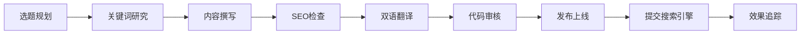

# M3U8 Converter 博客内容规范与计划

> 📅 更新日期：2026-01-22  
> 🌐 域名：https://www.m3u8converter.com/blog/

---

## 📋 内容范围

### 核心主题
博客内容应围绕以下核心领域展开：

| 主题类别 | 说明 | 优先级 |
|---------|------|--------|
| **M3U8/HLS 技术** | 协议原理、格式解析、技术深度 | ⭐⭐⭐ |
| **视频下载教程** | 操作指南、工具使用、问题解决 | ⭐⭐⭐ |
| **格式转换** | MP4/WebM/MKV 等格式转换方法 | ⭐⭐⭐ |
| **工具对比评测** | 下载器、转换器对比与推荐 | ⭐⭐ |
| **FFmpeg 教程** | 命令行使用、参数详解 | ⭐⭐ |
| **流媒体行业** | 技术趋势、平台动态 | ⭐ |

### 禁止内容
- ❌ 侵权内容下载指南
- ❌ 破解付费视频方法
- ❌ 违反平台服务条款的操作
- ❌ 恶意软件推广

---

## ✍️ 文章编写规范

### 结构模板

```html
<!DOCTYPE html>
<html lang="zh-CN">
<head>
  <meta charset="UTF-8">
  <title>[文章标题] | M3U8下载器</title>
  <meta name="description" content="[150字以内描述]">
  <meta name="keywords" content="[5-8个关键词]">
  <link rel="canonical" href="https://www.m3u8converter.com/blog/[slug].html">
  <!-- Schema.org 结构化数据 -->
</head>
<body>
  <!-- 面包屑导航 -->
  <!-- 文章标题 + 元信息(日期、阅读时间) -->
  <!-- 正文内容 -->
  <!-- CTA 链接到工具 -->
  <!-- 返回博客列表链接 -->
</body>
</html>
```

### 内容要求

| 项目 | 要求 |
|------|------|
| **标题** | 包含主关键词，20-35字为佳 |
| **正文字数** | 1500-3000字 |
| **段落** | 每段不超过4行，保持可读性 |
| **小标题** | 使用 H2/H3 层级，包含长尾关键词 |
| **图片** | 至少2张配图，WebP格式，存放于 `/blog/images/` |
| **内链** | 至少2个链接到其他博客文章 |
| **外链** | 1-2个权威来源链接 |
| **CTA** | 必须包含工具使用引导 |

### 图片资源规范

| 项目 | 要求 |
|------|------|
| **存放目录** | `/blog/images/[article-slug]/` |
| **命名规范** | 全小写，短横线连接，如 `step-1-open-browser.webp` |
| **格式** | 优先使用 WebP，兼容 PNG/JPG |
| **尺寸** | 宽度不超过 1200px，文件大小 < 200KB |
| **Alt 文字** | 必须填写，包含相关关键词 |

### 双语支持
- 所有文章需同时提供中英文版本
- 使用 `data-lang="zh"` / `data-lang="en"` 标签切换
- 语言切换器放置在页面顶部

---

## 🔍 SEO 要求

### 页面 SEO 清单

- [ ] **Title 标签**：关键词在前，品牌词在后，60字符内
- [ ] **Meta Description**：包含关键词，150-160字符
- [ ] **Canonical URL**：指向规范页面地址
- [ ] **H1 标签**：每页唯一，包含主关键词
- [ ] **URL Slug**：全小写，关键词用短横线连接
- [ ] **Schema.org**：添加 Article 结构化数据
- [ ] **Open Graph**：og:title, og:description, og:image
- [ ] **图片 Alt**：描述性文字，包含关键词

### 关键词策略

#### 核心关键词（中文）
```
m3u8下载器, m3u8转mp4, m3u8视频下载, m3u8转换器, 
在线m3u8下载, TS合并MP4, 直播回放下载, 网页视频下载,
HLS下载, 视频流下载
```

#### 核心关键词（英文）
```
m3u8 downloader, m3u8 to mp4, m3u8 converter, 
hls downloader, download m3u8 video, merge ts files,
convert m3u8 to mp4 online, free video downloader
```

#### 长尾关键词示例
- 如何下载网页上的 m3u8 视频
- m3u8 文件用什么软件打开
- 浏览器提取 m3u8 链接方法
- 免费在线 m3u8 转 mp4 工具

### 内链策略

每篇文章至少链接：
1. **工具首页** - 引导用户使用
2. **相关教程** - 增加停留时间
3. **技术原理** - 深度内容互联

---

## 📚 当前文章列表

| # | 文件名 | 标题（中文） | 目标关键词 | 状态 |
|---|--------|-------------|-----------|------|
| 1 | `how-to-download-m3u8-video.html` | 如何下载 M3U8 视频 - 完整教程 | m3u8下载教程 | ✅ 已发布 |
| 2 | `m3u8-to-mp4-guide.html` | M3U8 转 MP4 终极指南 | m3u8转mp4 | ✅ 已发布 |
| 3 | `what-is-hls-streaming.html` | 什么是 HLS 流媒体？M3U8 格式详解 | HLS流媒体, M3U8格式 | ✅ 已发布 |
| 4 | `merge-ts-files-to-mp4.html` | TS 文件合并为 MP4 的 3 种方法 | TS合并MP4 | ✅ 已发布 |
| 5 | `best-m3u8-downloader-2026.html` | 2026 年最佳 M3U8 下载器推荐 | 最佳m3u8下载器 | ✅ 已发布 |
| 6 | `ffmpeg-m3u8-commands.html` | FFmpeg 下载 M3U8 完整命令指南 | ffmpeg m3u8 | ✅ 已发布 |
| 7 | `browser-extract-m3u8.html` | 浏览器获取 M3U8 链接的 5 种方法 | 提取m3u8链接 | ✅ 已发布 |
| 8 | `m3u8-vs-mp4-difference.html` | M3U8 与 MP4 有什么区别？ | m3u8和mp4区别 | ✅ 已发布 |

---

## 📅 后续文章计划

### 2026年 Q1（1-3月）

| 优先级 | 文件名 | 标题 | 目标关键词 | 预计发布 |
|--------|--------|------|-----------|---------|
| ✅ | `ffmpeg-m3u8-commands.html` | FFmpeg 下载 M3U8 完整命令指南 | ffmpeg m3u8 | ✅ 1月22日已发布 |
| ✅ | `browser-extract-m3u8.html` | 浏览器获取 M3U8 链接的 5 种方法 | 提取m3u8链接 | ✅ 1月22日已发布 |
| ✅ | `m3u8-vs-mp4-difference.html` | M3U8 与 MP4 有什么区别？ | m3u8和mp4区别 | ✅ 1月22日已发布 |
| 🟡 中 | `download-live-stream.html` | 如何下载直播回放视频 | 直播回放下载 | 3月 |
| 🟢 低 | `fix-m3u8-download-errors.html` | M3U8 下载常见错误及解决方法 | m3u8下载失败 | Q2 |

### 2026年 Q2（4-6月）

| 优先级 | 文件名 | 标题 | 目标关键词 |
|--------|--------|------|-----------|
| 🔴 高 | `encrypted-m3u8-guide.html` | 加密 M3U8 视频如何下载？ | 加密m3u8下载 |
| 🔴 高 | `mobile-m3u8-download.html` | 手机下载 M3U8 视频教程 | 手机m3u8下载 |
| 🟡 中 | `m3u8-batch-download.html` | 批量下载 M3U8 视频的方法 | 批量下载m3u8 |
| 🟡 中 | `vlc-m3u8-convert.html` | 使用 VLC 转换 M3U8 视频 | vlc m3u8 |
| 🟢 低 | `hls-drm-explained.html` | HLS DRM 保护原理详解 | HLS DRM |

### 长期计划（Q3-Q4）

- 视频教程系列（配合 YouTube）
- 常见视频平台专题指南
- 开发者 API 文档
- 用户使用案例分享

---

## 📊 发布流程



### 发布检查清单

- [ ] 文章内容完整，无错别字
- [ ] 中英文双版本就绪
- [ ] SEO 元标签完整
- [ ] Schema.org 结构化数据添加
- [ ] 图片压缩且有 Alt 文字
- [ ] 内链外链正常跳转
- [ ] 移动端显示正常
- [ ] 已添加到 sitemap.xml
- [ ] 已更新博客首页列表
- [ ] 已提交 Google Search Console

---

## 🔗 相关资源

| 资源 | 源码路径 | 线上访问路径 |
|------|---------|-------------|
| 站点地图 | `/public/sitemap.xml` | `https://www.m3u8converter.com/sitemap.xml` |
| Robots 文件 | `/public/robots.txt` | `https://www.m3u8converter.com/robots.txt` |
| 博客首页 | `/blog/index.html` | `https://www.m3u8converter.com/blog/` |
| 主工具页 | `/index.html` | `https://www.m3u8converter.com/` |

---

*本文档由 M3U8 Converter 团队维护，如有疑问请提交 [GitHub Issue](https://github.com/liqiujiong/m3u8converter/issues)*
